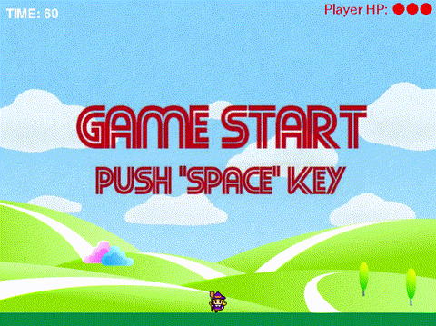
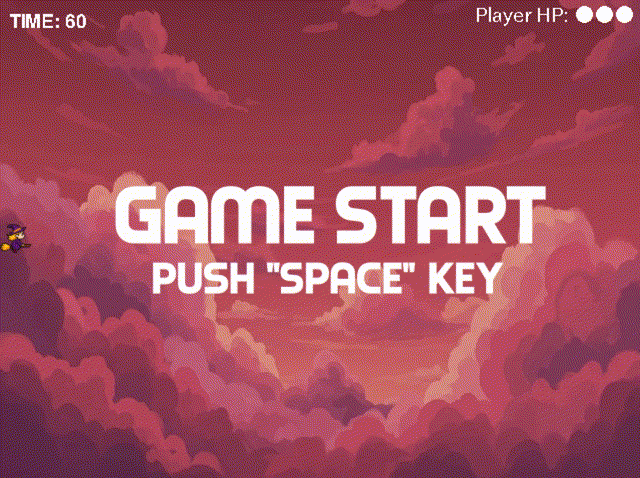

# Pygame-site

このサイトでは、**3つのPygameステージ**を
ブラウザから遊べるようにまとめています！

➡️ **Webサイトを見る**

[https://okamoto-airi.github.io/pygame-site/](https://okamoto-airi.github.io/pygame-site/)

## 使用技術

  
  
  

## Webサイトの特徴

- **動画の上にプレイボタンを配置**し、直感的に操作できるように工夫
- **背景に画像を使用**することで、遊ぶ前からワクワク感を演出
- **重要なキーワードを色付きで強調**し、説明文を読みやすく整理
- **レスポンシブ対応**により、スマホやタブレットからも快適に閲覧可能

## ゲームコース紹介

### ステージ1

- 移動：**A / D**
- 攻撃：**↑キー**
- 敵の攻撃は **相殺可能！**
- UFOを時間内に倒すとクリア！

👉 [ステージ1をプレイ！（PC版）](https://okamoto-airi.github.io/web-pygame_level1_PC/)

### ステージ2

- 移動：**W / S**
- 攻撃：**→キー**
- 一部の攻撃は **相殺不可**
- ドラゴンを倒してゲームクリア！

👉 [ステージ2をプレイ！（PC版）](https://okamoto-airi.github.io/web-pygame_level2-PC/)

### ステージ3

- 移動：**W / A / S / D**
- 攻撃：**矢印キー（全方向）**
- 最高難易度に挑戦！
- 目指せ最高ランククリア！

👉 [ステージ3をプレイ！（PC版）](https://okamoto-airi.github.io/web-pygame_level3-PC/)

## 遊び方のヒント

- 敵の攻撃に **3回当たるとゲームオーバー**
- ステージごとに操作方法が変わるので要チェック！
- キーボード操作のみ対応（PC推奨）

## ライセンス

MIT License

## 👥 制作

2025年 SIW チーム5
