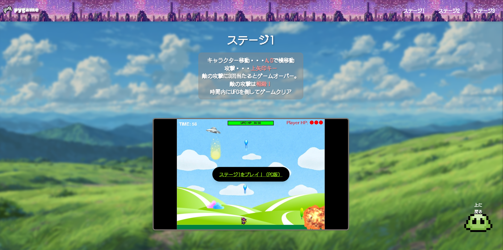
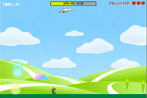
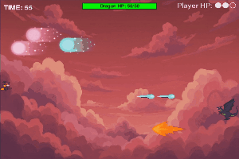
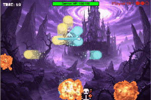

# Pygame-site
# 🌟 Pygame Web Showcase

このサイトでは、チーム制作で作った **3つのPygameステージ** を
ブラウザから遊べるようにまとめています！

  

---

## 🎮 ステージ1

- 移動：**A / D**
- 攻撃：**↑キー**
- 敵の攻撃は **相殺可能！**
- UFOを時間内に倒すとクリア！

👉 [ステージ1をプレイ！（PC版）](https://okamoto-airi.github.io/web-pygame_level1_PC/)

---

## 🎮 ステージ2

- 移動：**W / S**
- 攻撃：**→キー**
- 一部の攻撃は **相殺不可⚡**
- ドラゴンを倒してゲームクリア！

👉 [ステージ2をプレイ！（PC版）](https://okamoto-airi.github.io/web-pygame_level2-PC/)

---

## 🎮 ステージ3

- 移動：**W / A / S / D**
- 攻撃：**矢印キー（全方向）**
- 最高難易度に挑戦！
- 目指せ最高評価クリア！

👉 [ステージ3をプレイ！（PC版）](https://okamoto-airi.github.io/web-pygame_level3-PC/)

---

## 📌 遊び方のヒント
- 敵の攻撃に **3回当たるとゲームオーバー**
- ステージごとに操作方法が変わるので要チェック！
- キーボード操作のみ対応（PC推奨）

---

## 👥 制作
2025年 SIW チーム5
